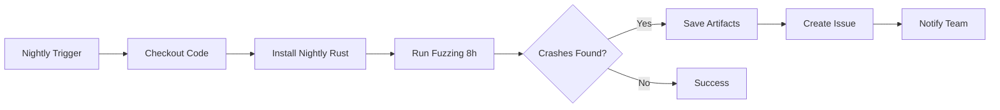

# ELARA Fuzzing Infrastructure Architecture

## Overview

The ELARA fuzzing infrastructure provides a trait-based framework for discovering edge cases, panics, and security vulnerabilities through automated fuzzing. It integrates with cargo-fuzz and libFuzzer for production-grade fuzzing campaigns.

## Architecture

### Core Components

```
┌─────────────────────────────────────────────────────────────┐
│                    elara-fuzz Crate                         │
├─────────────────────────────────────────────────────────────┤
│                                                             │
│  ┌──────────────┐      ┌──────────────┐                   │
│  │ FuzzTarget   │      │ FuzzResult   │                   │
│  │   (trait)    │      │    (enum)    │                   │
│  └──────────────┘      └──────────────┘                   │
│         │                      │                           │
│         │                      │                           │
│         └──────────┬───────────┘                           │
│                    │                                       │
└────────────────────┼───────────────────────────────────────┘
                     │
                     │ implements
                     │
         ┌───────────┴───────────┐
         │                       │
    ┌────▼─────┐         ┌──────▼──────┐
    │  Wire    │         │   Crypto    │
    │ Protocol │         │ Operations  │
    │  Fuzzer  │         │   Fuzzer    │
    └──────────┘         └─────────────┘
```

### Component Responsibilities

#### 1. FuzzTarget Trait

**Purpose**: Defines the interface for all fuzz targets.

**Key Methods**:
- `type Input: Arbitrary<'static>` - Defines the input type
- `fn fuzz_once(&mut self, input: Self::Input) -> FuzzResult` - Executes one fuzz iteration

**Design Rationale**: 
- Generic over input type for flexibility
- Stateful (`&mut self`) to allow fuzzer state
- Returns structured result for classification

#### 2. FuzzResult Enum

**Purpose**: Classifies the outcome of a fuzz iteration.

**Variants**:
- `Ok` - Input processed successfully (not a bug)
- `Bug(String)` - Found a bug (panic, assertion failure, unexpected error)
- `Invalid` - Input rejected as malformed (expected behavior)

**Design Rationale**:
- Distinguishes between expected failures (Invalid) and bugs (Bug)
- Carries error context in Bug variant
- Simple enough for fuzzer to understand

#### 3. Concrete Fuzzers

**Wire Protocol Fuzzer**:
- Tests: `Frame::parse()` with arbitrary bytes
- Goal: Find parsing bugs, buffer overflows, panics
- Input: Raw byte arrays

**Crypto Operations Fuzzer**:
- Tests: Encryption/decryption roundtrips
- Goal: Find crypto implementation bugs
- Input: Structured (plaintext, nonce, associated data)

**State Reconciliation Fuzzer**:
- Tests: State merge operations
- Goal: Find state inconsistencies
- Input: Sequences of state operations

## Integration with cargo-fuzz

### Directory Structure

```
fuzz/
├── Cargo.toml              # Fuzz target package
├── rust-toolchain.toml     # Nightly toolchain config
├── .gitignore              # Ignore corpus/artifacts
├── README.md               # Usage documentation
├── fuzz_targets/           # Fuzz target binaries
│   ├── wire_protocol.rs
│   ├── crypto_operations.rs
│   └── state_reconciliation.rs
├── corpus/                 # Seed inputs (generated)
│   ├── wire_protocol/
│   ├── crypto_operations/
│   └── state_reconciliation/
└── artifacts/              # Crash artifacts (generated)
    ├── wire_protocol/
    ├── crypto_operations/
    └── state_reconciliation/
```

### Fuzz Target Structure

Each fuzz target follows this pattern:

```rust
#![no_main]

use libfuzzer_sys::fuzz_target;
use elara_fuzz::{FuzzTarget, FuzzResult};

struct MyFuzzer {
    // Fuzzer state
}

impl FuzzTarget for MyFuzzer {
    type Input = MyInputType;
    
    fn fuzz_once(&mut self, input: Self::Input) -> FuzzResult {
        // Test code here
    }
}

fuzz_target!(|data: MyInputType| {
    let mut fuzzer = MyFuzzer::new();
    let _ = fuzzer.fuzz_once(data);
});
```

## Workflow

### Development Workflow

1. **Implement FuzzTarget**
   - Define input type with `#[derive(Arbitrary)]`
   - Implement `fuzz_once()` method
   - Classify outcomes as Ok/Bug/Invalid

2. **Create Fuzz Target Binary**
   - Add to `fuzz/fuzz_targets/`
   - Register in `fuzz/Cargo.toml`

3. **Test Locally**
   ```bash
   cd fuzz
   cargo +nightly fuzz run my_target -- -max_total_time=60
   ```

4. **Add to CI**
   - Update `.github/workflows/fuzz.yml`
   - Configure nightly runs

### CI Workflow



## Performance Considerations

### Target Performance

- **Throughput**: 10,000+ executions/second per core
- **Parallelization**: Use `-jobs=N` for multi-core
- **Memory**: Limit with `-rss_limit_mb=2048`

### Optimization Techniques

1. **Minimize Allocations**: Reuse buffers in fuzzer state
2. **Fast Path**: Return `Invalid` early for obviously bad input
3. **Corpus Minimization**: Periodically run `cargo fuzz cmin`
4. **Dictionary**: Add structure hints for complex formats

### Benchmarking

```bash
# Measure executions per second
cargo +nightly fuzz run wire_protocol -- -max_total_time=10 -print_final_stats=1
```

## Security Considerations

### Threat Model

**In Scope**:
- Memory safety bugs (buffer overflows, use-after-free)
- Panics and assertion failures
- Unexpected error conditions
- Cryptographic implementation bugs

**Out of Scope**:
- Timing attacks (requires specialized fuzzing)
- Side-channel attacks
- Logical vulnerabilities (requires property testing)

### Sanitizers

The fuzzing infrastructure uses:
- **AddressSanitizer (ASan)**: Detects memory errors
- **Coverage Instrumentation**: Guides fuzzer to new code paths

### Crash Triage

When a crash is found:

1. **Reproduce**: `cargo fuzz run target artifacts/target/crash-<hash>`
2. **Minimize**: `cargo fuzz tmin target artifacts/target/crash-<hash>`
3. **Debug**: Add to regression test suite
4. **Fix**: Implement fix and verify with fuzzer
5. **Verify**: Ensure crash no longer reproduces

## Testing Strategy

### Unit Tests

The `elara-fuzz` crate includes unit tests for:
- FuzzResult equality
- FuzzTarget trait implementation
- Example fuzzer behavior

Run with: `cargo test -p elara-fuzz`

### Integration Tests

Fuzz targets serve as integration tests:
- Test real ELARA components
- Use actual production code paths
- Discover real bugs

### Regression Tests

Crashes found by fuzzing become regression tests:
- Add crashing input to corpus
- Verify fix prevents crash
- Ensure crash stays fixed

## Maintenance

### Corpus Management

**Growing Corpus**:
- Fuzzer automatically adds interesting inputs
- Manually add seed inputs to `corpus/<target>/`

**Minimizing Corpus**:
```bash
cargo fuzz cmin wire_protocol
```

**Merging Corpora**:
```bash
cargo fuzz cmin --merge wire_protocol corpus/wire_protocol/ new_corpus/
```

### Updating Fuzzers

When updating ELARA code:
1. Update fuzz targets if APIs change
2. Run fuzzing to verify no regressions
3. Update corpus if input format changes

### Monitoring

**Metrics to Track**:
- Executions per second
- Code coverage
- Crashes found
- Corpus size

**Alerting**:
- New crashes trigger GitHub issues
- Coverage drops indicate dead code
- Performance degradation needs investigation

## Future Enhancements

### Planned Improvements

1. **Structure-Aware Fuzzing**: Use dictionaries for wire protocol
2. **Differential Fuzzing**: Compare implementations
3. **Stateful Fuzzing**: Test protocol state machines
4. **Coverage-Guided Mutations**: Improve input generation

### Research Directions

1. **Formal Verification Integration**: Use fuzzing to guide verification
2. **Symbolic Execution**: Combine with fuzzing for deeper coverage
3. **Taint Analysis**: Track data flow for security properties

## References

- [cargo-fuzz Book](https://rust-fuzz.github.io/book/cargo-fuzz.html)
- [libFuzzer Documentation](https://llvm.org/docs/LibFuzzer.html)
- [Arbitrary Crate](https://docs.rs/arbitrary/)
- [ELARA Design Document](../../../docs/specs/production-readiness-implementation/design.md)
