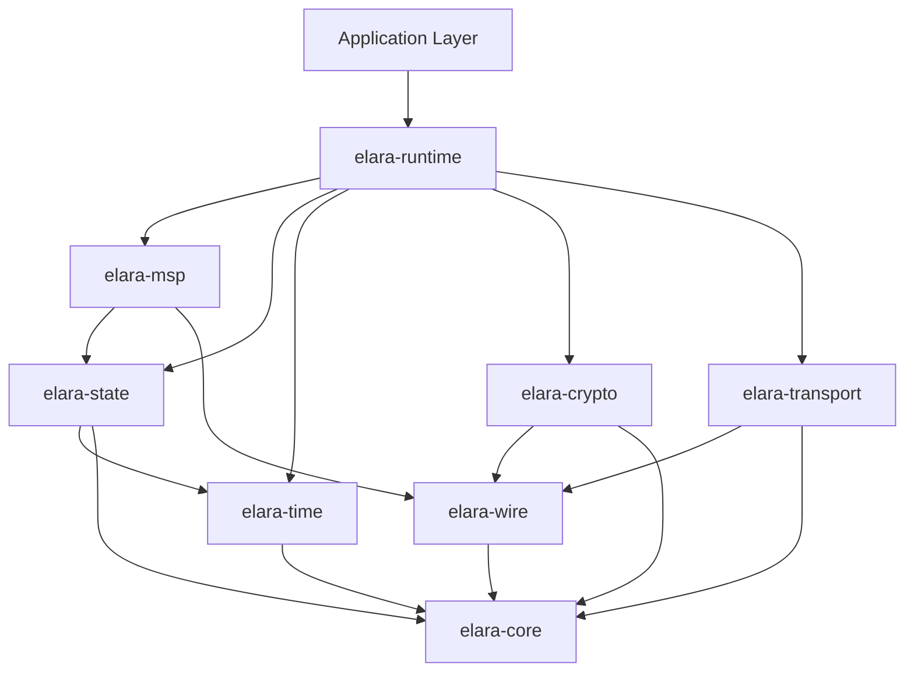

# ELARA Protocol: Comprehensive Architecture Documentation

**Version**: 0.2.0  
**Status**: Production Ready  
**Last Updated**: 2024-01

---

## Table of Contents

1. [Executive Summary](#executive-summary)
2. [Core Architecture](#core-architecture)
3. [Four Pillars](#four-pillars)
4. [Wire Protocol](#wire-protocol)
5. [Cryptographic Architecture](#cryptographic-architecture)
6. [Time Engine](#time-engine)
7. [State Reconciliation](#state-reconciliation)
8. [Visual State System](#visual-state-system)
9. [MSP (Multi-Sensory Protocol)](#msp-multi-sensory-protocol)
10. [Production Readiness Features](#production-readiness-features)
11. [Deployment Architecture](#deployment-architecture)
12. [Performance Characteristics](#performance-characteristics)
13. [Security Model](#security-model)
14. [Operational Considerations](#operational-considerations)

---

## Executive Summary

### What is ELARA Protocol?

**ELARA** (Emylton Leunufna Adaptive Reality Architecture) is a universal real-time communication substrate designed for cryptographic reality synchronization. Unlike traditional protocols that treat network problems as errors to handle, ELARA treats time as a first-class protocol object that bends under pressure rather than breaking.

### Key Innovations

1. **Dual Clock System**: Perceptual time (τp) for smooth UX + State time (τs) for network consensus
2. **Graceful Degradation**: Experience quality reduces but never collapses
3. **Event-Centric Architecture**: Events are truth, state is projection
4. **Cryptographic Reality Physics**: Identity-bound, server-blind encryption
5. **CRDT-Like State Reconciliation**: Automatic conflict resolution without central authority

### Differentiators

| Traditional Protocols | ELARA Protocol |
|----------------------|----------------|
| Session-centric | Event-centric |
| Binary failure modes | Graceful degradation |
| Synchronized state | Eventual convergence |
| Trust-based | Cryptographically proven |
| Media-focused | Reality-focused |


### Use Cases and Target Applications

**Ideal For:**
- Real-time collaboration tools
- Voice/video communication under poor network conditions
- IoT and sensor networks with intermittent connectivity
- Gaming with state synchronization requirements
- Distributed systems requiring eventual consistency
- Mission-critical communications in hostile network environments

**Production Readiness Status:**

✅ **Production Ready v0.2.0**
- Complete 16-crate architecture
- Comprehensive test coverage
- Security hardening (fuzzing, audits, SBOM)
- Observability infrastructure (logging, metrics, tracing)
- Performance validation (benchmarks, load testing)
- Operational tooling (health checks, alerting)

---

## Core Architecture

### 16-Crate Architecture Overview

ELARA is structured as a modular system of 16 crates, each with specific responsibilities:

```
┌─────────────────────────────────────────────────────────────┐
│                    ELARA PROTOCOL STACK                      │
├─────────────────────────────────────────────────────────────┤
│  elara-runtime    │  Node orchestration & event loop        │
│  elara-msp        │  Multi-Sensory Protocol profiles        │
├─────────────────────────────────────────────────────────────┤
│  elara-transport  │  Network transport (UDP, STUN)          │
│  elara-state      │  State reconciliation & CRDT            │
│  elara-time       │  Dual clock system & time engine        │
│  elara-crypto     │  Cryptographic binding & security       │
│  elara-wire       │  Wire protocol encoding/decoding        │
├─────────────────────────────────────────────────────────────┤
│  elara-core       │  Core types & primitives                │
├─────────────────────────────────────────────────────────────┤
│  Supporting Crates                                           │
│  elara-test       │  Testing harness & security tests       │
│  elara-ffi        │  Foreign function interface             │
│  elara-visual     │  Visual state encoding                  │
│  elara-diffusion  │  Swarm diffusion protocols              │
│  elara-voice      │  Voice encoding & synthesis             │
│  elara-fuzz       │  Fuzzing infrastructure                 │
│  elara-bench      │  Performance benchmarking               │
│  elara-loadtest   │  Load testing framework                 │
└─────────────────────────────────────────────────────────────┘
```


#### Crate 1: elara-core

**Purpose**: Foundation types and primitives for the entire protocol.

**Key Components:**
- `NodeId`: Cryptographically-derived node identity
- `SessionId`: Session identification
- `StateId`: State atom identification
- `EventId`: Event identification
- `VersionVector`: Causal ordering structure
- Core traits and interfaces

**Responsibilities:**
- Define fundamental data types
- Provide serialization/deserialization
- Establish type safety guarantees
- No external dependencies (pure Rust)

#### Crate 2: elara-wire

**Purpose**: Binary wire protocol encoding and decoding.

**Key Components:**
- `Frame`: Wire protocol frame structure
- `FixedHeader`: 28-byte fixed header
- `PacketClass`: Core, Perceptual, Enhancement, Cosmetic, Repair
- `RepresentationProfile`: Protocol profiles (Text, Voice, Video, etc.)
- Extension system (TLV format)

**Responsibilities:**
- Encode events to binary frames
- Decode binary frames to events
- Handle fragmentation and reassembly
- MTU-aware frame construction (1200 bytes max)
- Zero-copy parsing where possible

**Frame Structure:**
```
┌────────────────────────────────────────────┐
│     Fixed Header (28 bytes)                │
├────────────────────────────────────────────┤
│     Variable Header Extensions (TLV)       │
├────────────────────────────────────────────┤
│     Encrypted Payload                      │
├────────────────────────────────────────────┤
│     Auth Tag (16 bytes)                    │
└────────────────────────────────────────────┘
```


#### Crate 3: elara-crypto

**Purpose**: Cryptographic engine providing identity binding and multi-ratchet encryption.

**Key Components:**
- `Identity`: Ed25519 signing + X25519 encryption keys
- `SecureFrame`: AEAD-encrypted frame processor
- `ClassRatchet`: Per-class key ratcheting
- `ReplayWindow`: Replay attack protection
- Key derivation (HKDF-SHA256)

**Cryptographic Primitives:**
- **Signing**: Ed25519 (256-bit keys)
- **Key Exchange**: X25519 (256-bit keys)
- **AEAD**: ChaCha20-Poly1305 (256-bit key, 96-bit nonce)
- **KDF**: HKDF-SHA256
- **Hash**: SHA-256

**Multi-Ratchet Hierarchy:**
```
K_session_root
├── K_core (strongest protection, never dropped)
├── K_perceptual (fast ratchet, loss tolerant)
├── K_enhancement (standard protection)
└── K_cosmetic (light protection, free to drop)
```

**Responsibilities:**
- Generate and manage cryptographic identities
- Derive NodeId from public keys
- Encrypt/decrypt frames with AEAD
- Maintain per-class key ratchets
- Protect against replay attacks
- Provide forward secrecy

#### Crate 4: elara-time

**Purpose**: Time convergence engine with dual clock system.

**Key Components:**
- `PerceptualClock` (τp): Monotonic, smooth, local-driven
- `StateClock` (τs): Elastic, correctable, convergence-oriented
- `TimeEngine`: Orchestrates both clocks
- `NetworkModel`: Passive network learning
- `HorizonConfig`: Prediction and correction horizons

**Dual Clock System:**

| Clock | Symbol | Properties | Purpose |
|-------|--------|------------|---------|
| Perceptual | τp | Monotonic, smooth, never jumps | User experience |
| State | τs | Elastic, correctable, drift-tolerant | Network consensus |


**Reality Window:**
```
Past ←──────────────────────────────────────────→ Future
      │                    │                    │
      τs - Hc              τs                   τs + Hp
      │                    │                    │
      └── Correction ──────┴──── Prediction ────┘
          Horizon                 Horizon
```

**Four Internal Loops:**
1. **Drift Estimation**: Estimates clock drift relative to peers
2. **Prediction**: Predicts future state based on trajectory
3. **Correction**: Applies corrections from authoritative events
4. **Compression**: Reduces detail under resource pressure

**Responsibilities:**
- Maintain smooth perceptual time for UX
- Synchronize state time across network
- Adapt horizons based on network conditions
- Enable non-destructive time corrections
- Support graceful degradation under pressure

#### Crate 5: elara-state

**Purpose**: State field engine with CRDT reconciliation and partition tolerance.

**Key Components:**
- `StateField`: Distributed state as physical field
- `StateAtom`: Individual state unit
- `VersionVector`: Causal ordering
- `Authority`: Permission model
- `QuarantineBuffer`: Out-of-order event handling

**State Types:**
- **Core**: Essential state (identity, membership) - never drop
- **Perceptual**: Real-time sensory (voice, video) - drop old
- **Enhancement**: Quality improvements - drop under pressure
- **Cosmetic**: Non-essential decorations - free to drop

**Reconciliation Pipeline (6 Stages):**
```
Incoming Event
      ↓
1. Authority Check → Verify permissions
      ↓
2. Causality Check → Ensure dependencies exist
      ↓
3. Temporal Placement → Map to state time
      ↓
4. Delta Merge → Non-destructive combination
      ↓
5. Divergence Control → Reduce detail if needed
      ↓
6. Swarm Diffusion → Propagate to interested peers
```


**Delta Laws:**
- `LastWriteWins`: Replace entirely
- `AppendOnly`: Append-only log (for chat)
- `SetCRDT`: Set operations with add/remove wins
- `PNCounter`: Positive-negative counter
- `FrameBased`: Continuous state (for media)
- `Ephemeral`: Time-limited state (for typing indicators)

**Responsibilities:**
- Manage distributed state field
- Reconcile concurrent updates
- Handle network partitions gracefully
- Maintain causal ordering
- Provide eventual convergence guarantees
- Contain Byzantine behavior

#### Crate 6: elara-transport

**Purpose**: Network transport layer with NAT traversal.

**Key Components:**
- UDP socket management
- STUN client for NAT traversal
- Packet routing and delivery
- Connection management
- Network quality monitoring

**Responsibilities:**
- Send/receive UDP packets
- Perform NAT hole punching
- Handle packet loss and reordering
- Monitor network conditions
- Support relay fallback (TURN planned)

#### Crate 7: elara-runtime

**Purpose**: Node orchestration and event loop processing.

**Key Components:**
- `Node`: Main runtime orchestrator
- `NodeConfig`: Configuration management
- `Session`: Multi-party session management
- Event loop (async with tokio)
- Stream processing

**Observability Features:**
- Structured logging (tracing)
- Metrics collection (Prometheus-compatible)
- Distributed tracing (OpenTelemetry)
- Health check API


**Responsibilities:**
- Orchestrate all subsystems
- Process incoming/outgoing events
- Manage sessions and participants
- Coordinate time, state, crypto, and transport
- Expose observability interfaces
- Handle graceful shutdown

#### Crate 8: elara-msp

**Purpose**: Multi-Sensory Protocol profiles (text, voice, video).

**Key Components:**
- `TextStream`: Real-time text messaging
- `VoiceStream`: Parametric voice encoding
- `TextMessage`: Message structure
- `VoiceFrame`: Speech parameters (not raw audio)
- Degradation management

**MSP v0 Profiles:**
- **Textual (0x01)**: Chat, presence, typing indicators
- **VoiceMinimal (0x02)**: Real-time speech state

**Voice Encoding:**
Instead of raw audio (PCM/Opus), ELARA encodes speech as parameters:
```rust
struct VoiceFrame {
    voiced: bool,           // Voiced or unvoiced
    pitch: u8,              // F0 index (50-500Hz)
    energy: u8,             // dB level
    spectral_env: [u8; 10], // LPC coefficients
    residual_seed: u16,     // Excitation regeneration
}
```

**Benefits:**
- 2-4 kbps bandwidth (vs 6-32 kbps for Opus)
- Graceful degradation (parameters → symbolic → presence)
- Network-independent quality
- Reconstruction at receiver

**Responsibilities:**
- Implement protocol profiles
- Encode/decode media streams
- Manage degradation levels
- Provide cross-platform compatibility


#### Crate 9: elara-visual

**Purpose**: Visual state encoding and scene composition (future).

**Status**: Planned for post-v1.0

**Planned Components:**
- Keyframe and delta encoding
- Prediction and interpolation
- Face tracking integration
- Pose estimation
- Scene composition

### Component Interactions



### Data Flow

**Outgoing Message Flow:**
```
Application
    ↓ (create event)
MSP Profile
    ↓ (encode to state delta)
State Engine
    ↓ (apply delta, update version vector)
Time Engine
    ↓ (stamp with temporal intent)
Wire Protocol
    ↓ (encode to binary frame)
Crypto Engine
    ↓ (encrypt with AEAD)
Transport Layer
    ↓ (send UDP packet)
Network
```


**Incoming Message Flow:**
```
Network
    ↓ (receive UDP packet)
Transport Layer
    ↓ (parse frame header)
Crypto Engine
    ↓ (decrypt and verify AEAD)
Wire Protocol
    ↓ (decode binary frame)
Time Engine
    ↓ (map to local time, classify)
State Engine
    ↓ (reconciliation pipeline: 6 stages)
MSP Profile
    ↓ (decode state delta)
Application
    ↓ (present to user)
```

### State Management

**State Lifecycle:**
```
┌─────────────┐
│   Created   │ ← StateCreate event
└──────┬──────┘
       │
       ▼
┌─────────────┐
│   Active    │ ← StateUpdate events
└──────┬──────┘
       │
       ▼
┌─────────────┐
│  Archived   │ ← StateDelete event (soft)
└──────┬──────┘
       │
       ▼
┌─────────────┐
│   Purged    │ ← Garbage collection
└─────────────┘
```

**State Atom Structure:**
```rust
struct StateAtom {
    id: StateId,
    state_type: StateType,
    authority_set: HashSet<NodeId>,
    version_vector: VersionVector,
    delta_law: DeltaLaw,
    bounds: StateBounds,
    entropy_model: EntropyModel,
    value: StateValue,
}
```

---

## Four Pillars

ELARA is built on four unified pillars that work as one engine:


```
┌─────────────────────────────────────────────────────────────┐
│                    ELARA UNIFIED ENGINE                      │
├─────────────────┬─────────────────┬─────────────────┬───────┤
│  Cryptographic  │      Time       │   State Field   │ Packet│
│    Reality      │   Convergence   │    & Swarm      │Ecology│
│    Physics      │     Engine      │   Diffusion     │& Wire │
├─────────────────┼─────────────────┼─────────────────┼───────┤
│   Identity      │   Dual Clocks   │  Reconciliation │ Frame │
│   Session       │   Reality       │  Authority      │ Class │
│   Authority     │   Window        │  Causality      │ Header│
│   Encryption    │   Horizons      │  Convergence    │ AEAD  │
└─────────────────┴─────────────────┴─────────────────┴───────┘
```

### Pillar 1: Cryptographic Reality Physics

Everything in ELARA is cryptographically bound. There is no "trust" - only mathematical proof.

**Identity Binding:**
```rust
// NodeId derived from public keys
NodeId = SHA256("elara-node-id-v0" || verifying_key || encryption_public)[0..8]
```

**Session Binding:**
- Session root key derived from X25519 key exchange
- All class keys derived from session root via HKDF
- Each message encrypted with ratcheted key
- Forward secrecy through key ratcheting

**Multi-Ratchet System:**
- **Core**: Strongest protection, slow ratchet, never dropped
- **Perceptual**: Fast ratchet, loss tolerant, real-time
- **Enhancement**: Medium ratchet, standard protection
- **Cosmetic**: Minimal ratchet, light protection

**AEAD Encryption:**
- Algorithm: ChaCha20-Poly1305
- Nonce: Derived from (NodeId, Sequence, PacketClass)
- AAD: Frame header (authenticated but not encrypted)
- Tag: 16 bytes appended to ciphertext

**Replay Protection:**
- Per-(node_id, class) replay window
- 64-packet sliding window with bitmap
- Handles wraparound and out-of-order delivery
- Automatic window advancement


### Pillar 2: Time Convergence Engine

Time is not a passive timestamp - it's an active protocol participant.

**Dual Clock System:**

**Perceptual Clock (τp):**
- **Purpose**: User experience smoothness
- **Properties**: Monotonic, smooth, local-driven
- **Guarantees**: Never jumps, never goes backward
- **Use Cases**: Media playback, UI updates, local interactions

**State Clock (τs):**
- **Purpose**: Network consensus
- **Properties**: Elastic, correctable, convergence-oriented
- **Guarantees**: Eventual consistency, causal ordering
- **Use Cases**: Event ordering, state reconciliation, network sync

**Reality Window:**
- **Correction Horizon (Hc)**: How far back we can fix (80-600ms)
- **Prediction Horizon (Hp)**: How far ahead we predict (40-300ms)
- **Adaptive**: Expands under poor network, contracts under good network

**Event Classification:**
- **TooOld**: Beyond correction horizon → Archive
- **Correctable**: Within correction horizon → Apply with blending
- **Current**: At present → Apply immediately
- **Predicted**: Within prediction horizon → Apply with prediction
- **TooFuture**: Beyond prediction horizon → Quarantine

**Four Internal Loops:**
1. **Drift Estimation** (100ms tick): Estimates clock drift from peers
2. **Prediction** (16ms tick): Predicts future state trajectory
3. **Correction** (10ms tick): Applies corrections smoothly
4. **Compression** (100ms tick): Reduces detail under pressure

**Non-Destructive Correction:**
- Never hard rewind (jump backward)
- Never full reset (lose state)
- Never freeze timeline (stop time)
- Always blend corrections smoothly
- Always preserve continuity


### Pillar 3: State Field & Swarm Diffusion

State exists as a field that propagates through the network like a physical phenomenon.

**State Field Structure:**
```rust
StateField = {
    atoms: Map<StateId, StateAtom>,
    quarantine: Vec<QuarantinedEvent>,
    heat_map: Map<StateId, f64>,
    authority_graph: AuthorityGraph
}
```

**Reconciliation Pipeline (6 Stages):**

**Stage 1: Authority Check**
- Verify source has authority over target state
- Validate cryptographic signature
- Check delegation chain if present
- Reject if unauthorized

**Stage 2: Causality Check**
- Compare version vectors
- Detect happens-before relationships
- Identify concurrent updates
- Quarantine if dependencies missing

**Stage 3: Temporal Placement**
- Map remote time to local time
- Classify event position in reality window
- Archive if too old, quarantine if too future
- Determine correction weight

**Stage 4: Delta Merge**
- Apply mutation according to delta law
- Non-destructive combination
- Respect state bounds
- Update version vector

**Stage 5: Divergence Control**
- Check entropy against threshold
- Simplify state if diverging
- Increase tolerance for perceptual state
- Flag core state for manual resolution

**Stage 6: Swarm Diffusion**
- Update relevance/heat maps
- Determine interested peers
- Queue for transmission
- Limit fanout to prevent storms


**Version Vector Operations:**
```rust
// Causal ordering
v1.happens_before(v2)  // v1 causally precedes v2
v1.concurrent_with(v2) // Neither precedes the other
v1.dominates(v2)       // v1 >= v2 for all entries

// Merge (element-wise max)
v3 = v1.merge(v2)
```

**Partition Handling:**
```
Normal:     A ←→ B ←→ C ←→ D

Partition:  A ←→ B    C ←→ D
            (sub1)    (sub2)
            Both operate independently

Merge:      Exchange summaries
            Detect divergence
            Replay missing deltas
            Normalize time
            Resume unified operation
```

**Convergence Guarantee:**
All nodes eventually reach equivalent reality (not identical bits, but equivalent meaning).

### Pillar 4: Packet Ecology & Wire Semantics

Packets form an ecology with different survival priorities.

**Packet Classes:**

| Class | Priority | Drop Policy | Use Case |
|-------|----------|-------------|----------|
| Core | Highest | Never drop | Identity, session |
| Perceptual | High | Drop old | Voice, video |
| Enhancement | Medium | Drop under pressure | HD, effects |
| Cosmetic | Low | Free to drop | Reactions, typing |
| Repair | Variable | Context-dependent | Gap fill, sync |

**Frame Structure:**
- Fixed Header: 28 bytes (version, flags, session, node, class, seq, time)
- Variable Extensions: TLV format (optional)
- Encrypted Payload: Event blocks
- Auth Tag: 16 bytes (Poly1305)

**Graceful Degradation:**
```
Full Quality → Voice+Video → Voice Only → Voice Parameters
    → Symbolic State → Presence Only → Identity Heartbeat
```

Session NEVER drops. Reality simplifies.


---

## Wire Protocol

### Frame Format

**Fixed Header (28 bytes):**
```
Offset  Size  Field         Description
──────────────────────────────────────────────────────
0       1     VERSION       [V:4][C:4] Version + Crypto suite
1       1     FLAGS         Frame flags
2       2     HEADER_LEN    Total header length
4       8     SESSION_ID    Reality space binding
12      8     NODE_ID       Source identity fingerprint
20      1     CLASS         Packet class
21      1     PROFILE       Representation profile hint
22      2     SEQ_WINDOW    Sequence number
24      4     TIME_HINT     Offset relative to τs (signed i32)
```

**FLAGS Byte:**
- Bit 7: MULTIPATH - Frame may arrive via multiple paths
- Bit 6: RELAY - Frame is being relayed
- Bit 5: FRAGMENT - Frame is a fragment
- Bit 4: REPAIR - Frame is a repair/retransmit
- Bit 3: PRIORITY - High priority frame
- Bit 2: EXTENSION - Has header extensions
- Bits 1-0: Reserved

**Header Extensions (TLV):**
- Type (1 byte) + Length (1 byte) + Value (Length bytes)
- Types: FRAGMENT_INFO, RELAY_PATH, PRIORITY_HINT, TIMESTAMP_FULL, ACK_VECTOR, EPOCH_SYNC

**Encrypted Payload:**
Contains Event Blocks (not raw media):
```
┌─────────────────────────────────────────┐
│ Event Block 1                           │
├─────────────────────────────────────────┤
│ Event Block 2                           │
├─────────────────────────────────────────┤
│ ...                                     │
└─────────────────────────────────────────┘
```

**Event Block Format:**
- EVENT_TYPE (1 byte)
- STATE_ID (8 bytes)
- VERSION_LEN (2 bytes)
- VERSION_VEC (variable)
- DELTA_LEN (2 bytes)
- DELTA (variable)


### MTU Handling

| Constraint | Value | Rationale |
|------------|-------|-----------|
| Min frame | 28 bytes | Header only |
| Max frame | 1200 bytes | UDP-safe MTU |
| Max payload | ~1150 bytes | After header + tag |
| Max extensions | 256 bytes | Practical limit |

### Fragmentation

For payloads exceeding MTU:
1. Split into fragments
2. Set FRAGMENT flag
3. Add FRAGMENT_INFO extension
4. Each fragment independently encrypted
5. Receiver reassembles based on fragment ID

---

## Cryptographic Architecture

### Identity System

**Key Generation:**
```rust
// Signing keypair (Ed25519)
let signing_key = Ed25519SigningKey::generate(&mut OsRng);
let verifying_key = signing_key.verifying_key();

// Encryption keypair (X25519)
let encryption_secret = X25519StaticSecret::random_from_rng(&mut OsRng);
let encryption_public = X25519PublicKey::from(&encryption_secret);

// Derive NodeId
let node_id = derive_node_id(&verifying_key, &encryption_public);
```

**NodeId Derivation:**
```rust
NodeId = SHA256("elara-node-id-v0" || verifying_key || encryption_public)[0..8]
```

### Session Establishment

**Key Exchange Protocol:**
1. Alice generates ephemeral X25519 keypair
2. Alice sends (ephemeral_public, node_id, signature)
3. Bob verifies signature
4. Bob generates ephemeral keypair
5. Bob computes shared secret
6. Bob sends (ephemeral_public, node_id, signature)
7. Alice verifies signature
8. Alice computes shared secret
9. Both derive session root key


**Session Root Key Derivation:**
```rust
fn derive_session_root(
    shared_secret: &[u8; 32],
    alice_node_id: NodeId,
    bob_node_id: NodeId,
    session_id: SessionId
) -> [u8; 32] {
    // Canonical ordering
    let (first, second) = if alice_node_id < bob_node_id {
        (alice_node_id, bob_node_id)
    } else {
        (bob_node_id, alice_node_id)
    };
    
    let info = "elara-session-root-v0" || session_id || first || second;
    hkdf_sha256(shared_secret, &[], &info)
}
```

### Multi-Ratchet Key Hierarchy

**Class Key Derivation:**
```rust
K_core = HKDF(session_root, "elara-class-core-v0")
K_perceptual = HKDF(session_root, "elara-class-perceptual-v0")
K_enhancement = HKDF(session_root, "elara-class-enhancement-v0")
K_cosmetic = HKDF(session_root, "elara-class-cosmetic-v0")
```

**Ratchet Structure:**
```rust
struct ClassRatchet {
    chain_key: [u8; 32],
    epoch: u32,
    message_index: u32,
}

// Advance for each message
message_key = HKDF(chain_key, "msg-{index}")
chain_key = HKDF(chain_key, "chain-advance")
message_index += 1

// Advance epoch periodically
if message_index >= EPOCH_THRESHOLD {
    chain_key = HKDF(chain_key, "epoch-{epoch+1}")
    epoch += 1
    message_index = 0
}
```

**Ratchet Rates:**
- Core: 1000 messages/epoch (slow, high security)
- Perceptual: 100 messages/epoch (fast, loss tolerant)
- Enhancement: 500 messages/epoch (medium)
- Cosmetic: 1000 messages/epoch (lazy)


### Secure Frame Processing

**Encryption:**
```rust
// 1. Get message key from ratchet
let message_key = ratchet.advance_message();

// 2. Derive nonce
let nonce = derive_nonce(node_id, seq, class);
// nonce = node_id[0..8] || seq[0..2] || class[0..1] || 0x00

// 3. Encrypt with AEAD
let ciphertext = ChaCha20Poly1305::encrypt(
    key: message_key,
    nonce: nonce,
    aad: header,
    plaintext: payload
);
```

**Decryption:**
```rust
// 1. Parse header
let header = FixedHeader::parse(&frame[..28]);

// 2. Check replay
if !replay_window.accept(header.seq) {
    return Err(CryptoError::Replay);
}

// 3. Get message key
let message_key = ratchet.message_key();

// 4. Derive nonce
let nonce = derive_nonce(header.node_id, header.seq, header.class);

// 5. Decrypt and verify
let plaintext = ChaCha20Poly1305::decrypt(
    key: message_key,
    nonce: nonce,
    aad: &frame[..28],
    ciphertext: &frame[28..]
)?;

// 6. Advance ratchet
ratchet.advance_message();
```

### Replay Protection

**Sliding Window:**
```rust
struct ReplayWindow {
    min_seq: u16,
    bitmap: u64,  // 64-packet window
}

fn accept(&mut self, seq: u16) -> bool {
    let offset = seq.wrapping_sub(self.min_seq);
    
    // Handle wraparound
    if offset > 32768 {
        return false;  // Too old
    }
    
    // Check and set bit
    let bit_offset = seq.wrapping_sub(self.min_seq);
    if bit_offset < 64 {
        let mask = 1u64 << bit_offset;
        if self.bitmap & mask != 0 {
            return false;  // Replay
        }
        self.bitmap |= mask;
    }
    
    true
}
```


---

## Production Readiness Features

ELARA v1.0 includes comprehensive production-grade features implemented in recent phases.

### Observability Infrastructure

**Structured Logging:**
- Tracing-based logging with contextual fields
- JSON output for production
- Per-module log level configuration
- Integration with log aggregation systems (ELK, Splunk)

**Metrics Collection:**
- Prometheus-compatible metrics endpoint
- Counter, Gauge, and Histogram types
- Key metrics tracked:
  - Connection metrics (active, total, failed)
  - Message metrics (sent, received, dropped, size)
  - Latency metrics (message, state sync)
  - Resource metrics (memory, CPU)
  - Protocol metrics (time drift, state divergence, replay window)

**Distributed Tracing:**
- OpenTelemetry integration
- Span instrumentation for key operations
- Trace context propagation across nodes
- Export to Jaeger/Zipkin/OTLP
- Configurable sampling rates

### Security Hardening

**Fuzzing Infrastructure:**
- Continuous fuzzing with cargo-fuzz
- Wire protocol fuzzing (arbitrary byte sequences)
- Crypto operations fuzzing (malformed inputs)
- State reconciliation fuzzing (edge cases)
- 8-hour nightly fuzz campaigns
- Corpus generation and management

**Dependency Security:**
- Automated cargo-audit runs (daily)
- SBOM generation (CycloneDX format)
- Vulnerability scanning and reporting
- Security advisory notifications
- Dependency update automation

**Security Test Suite:**
- Replay attack protection tests
- Message authentication tests
- Key isolation tests
- Timing attack resistance tests
- Property-based security tests


### Performance Validation

**Benchmark Suite (elara-bench):**
- Wire protocol encoding/decoding benchmarks
- Cryptographic operation benchmarks
- State reconciliation benchmarks
- Time engine operation benchmarks
- Criterion-based with statistical analysis
- Performance regression detection in CI

**Load Testing Framework (elara-loadtest):**
- Realistic node topology simulation
- Sustained message load generation
- Latency measurement under load
- Bottleneck identification
- Graceful degradation validation
- Resource limit testing

**Predefined Scenarios:**
- Small deployment: 10 nodes, 5 connections/node, 100 msg/s
- Medium deployment: 100 nodes, 10 connections/node, 1000 msg/s
- Large deployment: 1000 nodes, 20 connections/node, 10000 msg/s

### Operational Tooling

**Health Check API:**
- HTTP endpoints (/health, /ready, /live)
- Kubernetes liveness/readiness probe support
- Pluggable health checks:
  - Connection health
  - Memory usage
  - Time drift
  - State convergence
- Cached results with configurable TTL

**Alerting Rules:**
- Prometheus alerting rules
- Thresholds for:
  - High message drop rate
  - High latency (P95, P99)
  - Node unhealthy status
  - High memory usage
  - Time drift exceeded
- Integration with PagerDuty/Opsgenie

**Operational Documentation:**
- Deployment guides
- Configuration best practices
- Troubleshooting runbooks
- Performance tuning guides
- Capacity planning guidelines


---

## Deployment Architecture

### Node Configuration

**Basic Node Setup:**
```rust
let config = NodeConfig {
    node_id: NodeId::generate(),
    bind_addr: "0.0.0.0:0".parse()?,
    max_peers: 100,
    event_buffer_size: 10000,
    prediction_entropy: 42,
    degradation_config: DegradationConfig::default(),
};

let mut node = Node::new(config).await?;
node.run().await?;
```

**Configuration Parameters:**
- `node_id`: Cryptographic identity
- `bind_addr`: UDP socket binding
- `max_peers`: Maximum concurrent connections
- `event_buffer_size`: Event queue capacity
- `prediction_entropy`: RNG seed for prediction
- `degradation_config`: Graceful degradation thresholds

### Session Management

**Session Lifecycle:**
```
Create → Establish → Active → Degraded → Suspended → Terminated
   ↓         ↓          ↓         ↓          ↓           ↓
 Init    Key Exch   Normal    Network    Partition   Cleanup
                    Ops       Issues     Healing
```

**Multi-Party Sessions:**
- Up to 8 participants (MSP v0)
- Mesh topology (full connectivity)
- Automatic peer discovery
- Dynamic membership changes
- Graceful participant leave/join

### Connection Topology

**1-1 Communication:**
```
Node A ←──────────────→ Node B
       Direct UDP
```

**Small Group (≤8 participants):**
```
    A ←→ B
    ↕ ╳ ↕
    C ←→ D
    
Full mesh topology
```

**Relay Fallback:**
```
Node A ←──→ Relay ←──→ Node B
       
When direct connection fails
```


### Resource Requirements

**Minimum Requirements:**
- CPU: 2 cores @ 1.5 GHz
- RAM: 2 GB
- Network: 50 kbps sustained
- Storage: 100 MB

**Recommended Requirements:**
- CPU: 4 cores @ 2.0 GHz
- RAM: 4 GB
- Network: 200 kbps sustained
- Storage: 500 MB

**Scaling Characteristics:**
- Memory: O(peers + active_states)
- CPU: O(message_rate + peer_count)
- Network: O(message_rate × peer_count)
- Storage: O(event_history_size)

---

## Performance Characteristics

### Throughput Expectations

| Scenario | Messages/sec | Bandwidth | Latency (P95) |
|----------|--------------|-----------|---------------|
| Text only | 1000+ | 50 kbps | <50ms |
| Voice (minimal) | 50 frames/s | 2-4 kbps | <100ms |
| Mixed (text+voice) | 500+ | 10-20 kbps | <100ms |

### Latency Characteristics

**Message Latency Components:**
```
Total Latency = Encoding + Crypto + Network + Decoding + Reconciliation

Typical breakdown:
- Encoding: 0.1-1ms
- Crypto: 0.05-0.5ms
- Network: 10-200ms (variable)
- Decoding: 0.1-1ms
- Reconciliation: 0.5-5ms
```

**State Sync Latency:**
- Small state (<1KB): 5-20ms
- Medium state (1-10KB): 20-100ms
- Large state (>10KB): 100-500ms

### Resource Usage

**Memory Usage:**
- Base runtime: 10-20 MB
- Per peer: 100-500 KB
- Per active state: 1-10 KB
- Event buffer: 1-10 MB
- Total typical: 50-200 MB

**CPU Usage:**
- Idle: <1%
- Light load (10 msg/s): 5-10%
- Medium load (100 msg/s): 20-40%
- Heavy load (1000 msg/s): 60-80%


### Scaling Behavior

**Horizontal Scaling:**
- Each node operates independently
- No central coordination required
- Linear scaling with node count
- Mesh topology limits: ~8-10 nodes
- Relay topology: 100+ nodes

**Vertical Scaling:**
- CPU: More cores = more concurrent processing
- Memory: More RAM = larger event buffers
- Network: More bandwidth = higher quality

---

## Security Model

### Threat Model

**Protected Against:**
- ✅ Passive eavesdropping (AEAD encryption)
- ✅ Message replay (replay window)
- ✅ Message modification (authenticated encryption)
- ✅ Server-side content access (end-to-end encryption)
- ✅ Identity spoofing (cryptographic binding)
- ✅ Man-in-the-middle (key exchange with signatures)

**Not Protected Against:**
- ❌ Endpoint compromise (device takeover)
- ❌ Traffic analysis (metadata leakage)
- ❌ Denial of service (network flooding)
- ❌ Quantum computers (future concern)
- ❌ Social engineering (user manipulation)

### Security Guarantees

**Confidentiality:**
- All payload data encrypted with ChaCha20-Poly1305
- Forward secrecy through key ratcheting
- Per-class key isolation
- Server blindness by design

**Integrity:**
- All frames authenticated with Poly1305
- Cryptographic signatures on events
- Version vector integrity
- Causal ordering preservation

**Authenticity:**
- NodeId derived from public keys
- All events signed by author
- Delegation chains cryptographically verified
- Authority proofs required for state changes

**Availability:**
- Graceful degradation under attack
- Byzantine-light containment
- Rate limiting per node
- Anomaly detection and isolation


### Attack Surface

**Network Layer:**
- UDP packet injection (mitigated by crypto)
- Packet flooding (mitigated by rate limiting)
- Amplification attacks (mitigated by stateless design)

**Protocol Layer:**
- Replay attacks (mitigated by replay window)
- Version vector manipulation (mitigated by signatures)
- Authority escalation (mitigated by authority checks)

**Application Layer:**
- Malicious events (mitigated by authority system)
- State poisoning (mitigated by validation)
- Resource exhaustion (mitigated by bounds)

### Mitigation Strategies

**Rate Limiting:**
- Per-node event rate limits
- Per-class bandwidth limits
- Adaptive throttling under pressure

**Anomaly Detection:**
- Rapid-fire event detection
- Version vector anomalies
- Entropy spike detection
- Behavioral analysis

**Containment:**
- Low severity: Rate limit
- Medium severity: Temporary mute
- High severity: Complete isolation

---

## Operational Considerations

### Monitoring and Observability

**Key Metrics to Monitor:**
- Connection health (active, failed, total)
- Message throughput (sent, received, dropped)
- Latency (P50, P95, P99, max)
- Resource usage (memory, CPU, network)
- Protocol health (time drift, state divergence)
- Error rates (crypto failures, validation errors)

**Logging Best Practices:**
- Use structured logging (JSON in production)
- Include contextual fields (node_id, session_id, peer_id)
- Set appropriate log levels per module
- Rotate logs to prevent disk exhaustion
- Forward to centralized aggregation

**Tracing Best Practices:**
- Enable tracing for critical paths
- Use sampling in high-throughput scenarios
- Propagate trace context across nodes
- Export to distributed tracing system
- Analyze end-to-end request flows


### Performance Tuning

**Network Tuning:**
- Adjust UDP socket buffer sizes
- Configure STUN server endpoints
- Tune NAT keepalive intervals
- Optimize packet batching

**Time Engine Tuning:**
- Adjust prediction horizon (Hp) for latency tolerance
- Adjust correction horizon (Hc) for accuracy
- Tune tick intervals for CPU/accuracy tradeoff
- Configure drift estimation parameters

**State Engine Tuning:**
- Set appropriate entropy thresholds
- Configure quarantine buffer sizes
- Tune divergence control parameters
- Adjust fanout limits for diffusion

**Crypto Tuning:**
- Configure ratchet epoch thresholds
- Adjust replay window size
- Tune key derivation parameters

### Capacity Planning

**Estimating Resource Needs:**

**Memory:**
```
Total Memory = Base + (Peers × PeerMem) + (States × StateMem) + BufferMem

Where:
- Base: 20 MB
- PeerMem: 500 KB per peer
- StateMem: 5 KB per active state
- BufferMem: 10 MB for event buffers

Example (100 peers, 1000 states):
= 20 + (100 × 0.5) + (1000 × 0.005) + 10
= 20 + 50 + 5 + 10
= 85 MB
```

**CPU:**
```
CPU Usage ≈ (MessageRate × 0.0001) + (PeerCount × 0.001)

Example (1000 msg/s, 100 peers):
= (1000 × 0.0001) + (100 × 0.001)
= 0.1 + 0.1
= 20% of one core
```

**Network:**
```
Bandwidth = (MessageRate × AvgMessageSize × PeerCount) / 1000

Example (100 msg/s, 500 bytes avg, 10 peers):
= (100 × 500 × 10) / 1000
= 500 kbps
```


### Troubleshooting

**Common Issues and Solutions:**

**High Latency:**
- Check network conditions (jitter, loss)
- Verify time engine horizons are appropriate
- Inspect state reconciliation pipeline
- Review crypto overhead
- Check for CPU saturation

**Message Drops:**
- Verify packet class priorities
- Check network bandwidth
- Inspect degradation levels
- Review buffer sizes
- Monitor resource usage

**State Divergence:**
- Check version vector consistency
- Verify authority proofs
- Inspect quarantine buffer
- Review network partitions
- Check time synchronization

**Connection Failures:**
- Verify NAT traversal (STUN)
- Check firewall rules
- Inspect UDP socket configuration
- Review relay fallback
- Monitor connection metrics

**Memory Growth:**
- Check event buffer sizes
- Verify garbage collection
- Inspect state atom lifecycle
- Review quarantine buffer
- Monitor peer count

---

## Conclusion

ELARA Protocol represents a fundamental shift in how we approach real-time communication. By treating time as a first-class protocol object, embracing graceful degradation, and building on cryptographic foundations, ELARA enables continuous communication even under severe network chaos.

### Key Takeaways

1. **Event-Centric**: Events are truth, state is projection
2. **Time-Aware**: Dual clocks enable smooth UX and network consensus
3. **Graceful**: Experience degrades but never collapses
4. **Cryptographic**: Identity-bound, server-blind by design
5. **Convergent**: Eventual consistency without central authority
6. **Production-Ready**: Comprehensive observability, security, and operational tooling

### Future Directions

- Post-quantum cryptography (Kyber/NTRU)
- Video support (visual state encoding)
- Large group scaling (hierarchical topologies)
- Federation (cross-domain communication)
- AI agent integration (autonomous participants)
- Formal verification (critical components)


---

## References

### Core Documentation
- [HARD_INVARIANTS.md](../HARD_INVARIANTS.md) - System laws
- [PROTOCOL_MODEL.md](../PROTOCOL_MODEL.md) - Five foundational models
- [SYSTEM_SCIENCE.md](../SYSTEM_SCIENCE.md) - Foundational constructs
- [Core Concepts](core-concepts.md) - Fundamental primitives
- [Four Pillars](four-pillars.md) - Architecture overview

### Specifications
- [Wire Protocol](../specs/wire-protocol.md) - Binary frame format
- [Crypto Binding](../specs/crypto-binding.md) - Security specification
- [Time Engine](../specs/time-engine.md) - Temporal mechanics
- [State Reconciliation](../specs/state-reconciliation.md) - Convergence spec
- [MSP v0](../msp/msp-v0.md) - Minimum Survivable Product

### Implementation
- [API Reference](../implementation/api-reference.md) - Public APIs
- [Crate Structure](../implementation/crate-structure.md) - Code organization
- [Testing Strategy](../implementation/testing-strategy.md) - Test approach

### Operations
- [Performance Guide](../performance/PERFORMANCE_GUIDE.md) - Tuning and optimization
- [Performance Baselines](../performance/BASELINES.md) - Benchmark results
- [Load Testing](../../crates/elara-loadtest/README.md) - Load test framework
- [Benchmarking](../../crates/elara-bench/README.md) - Benchmark suite

### Security
- [Security Audit](../../.github/workflows/security-audit.yml) - Automated auditing
- [Fuzzing](../../fuzz/README.md) - Fuzz testing
- [SBOM Generation](../../scripts/generate-sbom.rs) - Software bill of materials

---

**Document Version**: 1.0  
**Last Updated**: 2026  
**Status**: Production Ready  
**Maintainer**: ELARA Protocol Team

